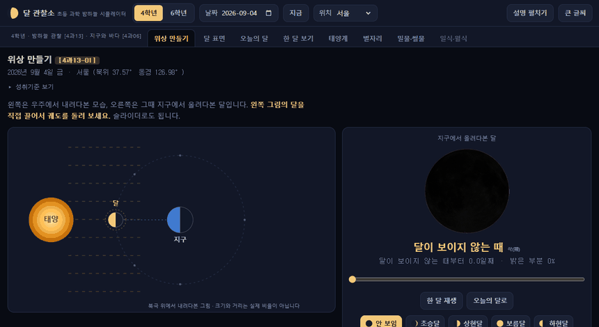
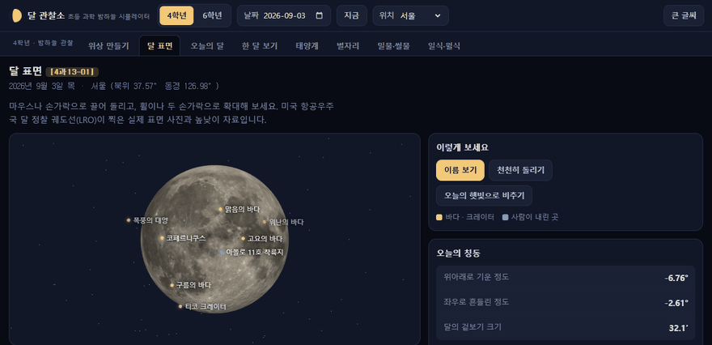
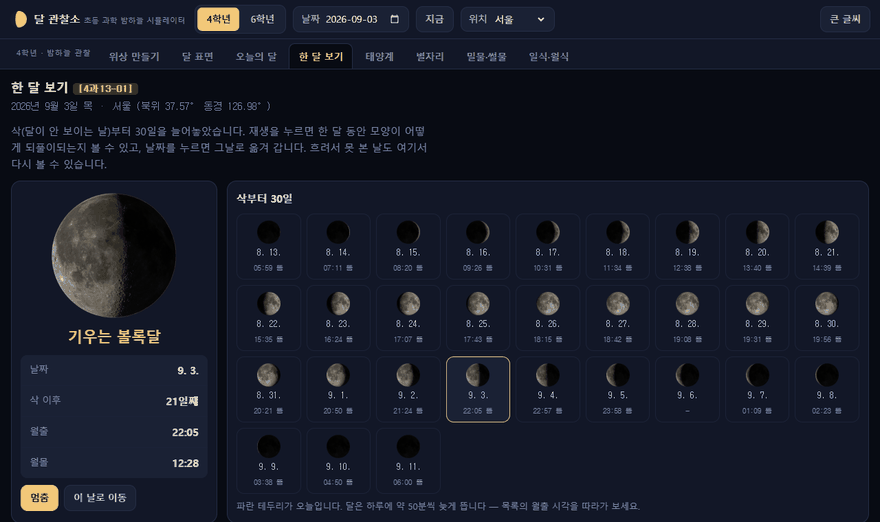
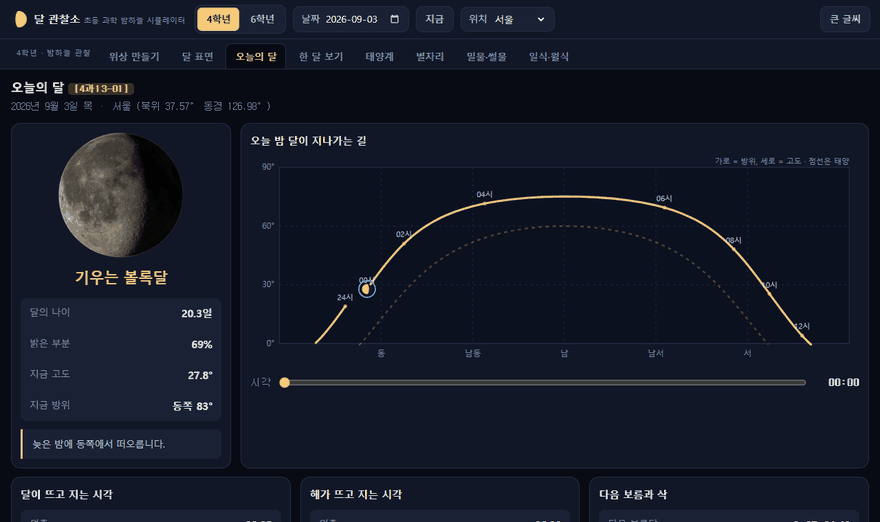
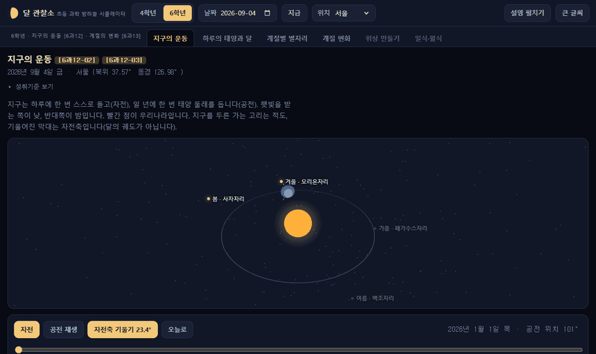
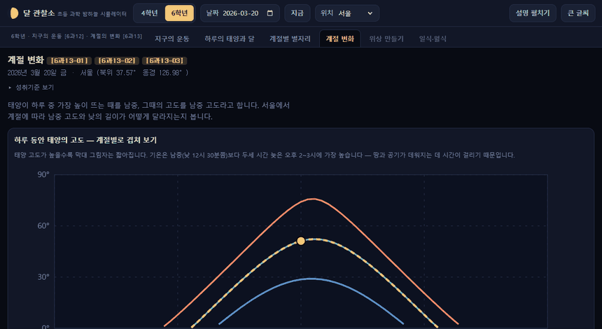
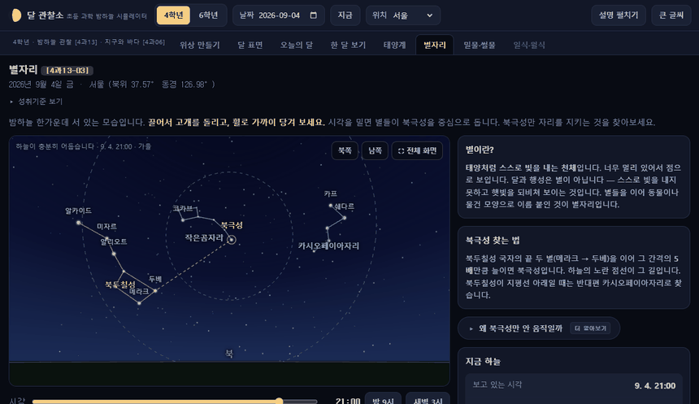
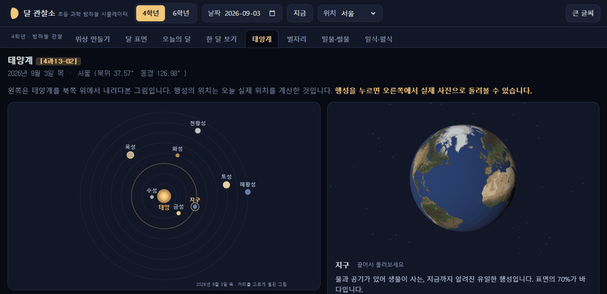
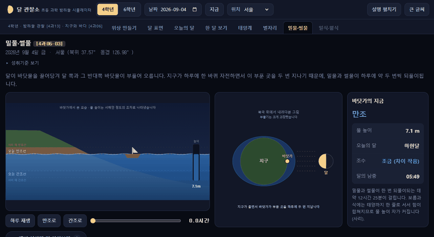
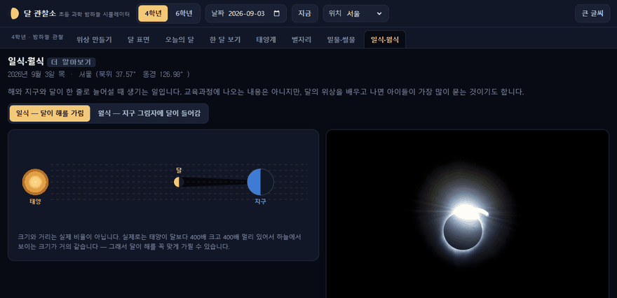

# 달 관찰소

**바로 열기 → https://choinssam.github.io/moon-observatory/**

만든 사람 **초인쌤** · 문의 choinssam@gmail.com
[](LICENSE)

초등 과학 **밤하늘 관찰** 단원을 교실에서 그대로 다룰 수 있게 만든 한국어 시뮬레이터입니다.
학생 기록을 받지 않고 **보여주는 데만** 집중합니다 — 서버도, 계정도, 로그인도 없습니다.

## 무엇을 근거로 만들었나

교육부 고시 제2022-33호 [별책 9] 과학과 교육과정 기준입니다.
2022 개정에서 달은 **3~4학년군 성취기준 하나**로 모였습니다.

| 성취기준 | 문구 | 대응 화면 |
|---|---|---|
| `[4과13-01]` | 달의 모양과 표면, 달의 위상변화를 관찰하여 밤하늘 관찰에 흥미를 가질 수 있다 | 위상 만들기 · 달 표면 · 오늘의 달 · 한 달 보기 |
| `[4과13-02]` | 태양계 구성원을 알고, 태양과 행성을 조사할 수 있다 | 태양계 |
| `[4과13-03]` | 별의 정의를 알고, 북극성 주변의 별자리를 관찰할 수 있다 | 별자리 |
| `[4과06-03]` | 밀물과 썰물의 차이를 알고, 갯벌의 가치와 보전의 필요성을 설득·홍보할 수 있다 | 밀물·썰물 |
| `[6과12-01~03]` | 태양과 별의 위치 변화, 지구의 자전과 공전, 계절별 별자리 | 지구의 운동 |
| `[6과13-01~03]` | 태양 고도, 남중 고도와 낮의 길이, 계절 변화의 원인 | 계절 변화 |

2015 개정에서 6학년이던 `[6과09-03]`(달의 위상 변화)은 2022 개정에서 4학년으로 내려왔습니다.
현행 5~6학년군 과학 성취기준에는 달을 다루는 항목이 없어, 6학년 모드는 지구의 운동에 대응합니다.

`[4과13-01]` 성취수준:

- **A** 달의 모양과 표면, 여러 날 동안 보이는 달의 위상 변화를 관찰하여 달의 모양이 주기적으로 바뀌는 것을 알고, 밤하늘 관찰에 흥미를 가진다
- **B** 여러 날 동안 보이는 달의 모양을 관찰하고, 밤하늘 관찰에 흥미를 가진다
- **C** 달을 관찰하고 밤하늘 관찰에 관심을 가진다

## 화면

### 위상 만들기 — 배치와 모양을 한 화면에서



슬라이더 하나로 우주에서 내려다본 배치와 지구에서 올려다본 달이 함께 움직입니다.
오른쪽 달은 그림이 아니라 NASA LRO 사진에 그날의 햇빛 방향을 계산해 입힌 것입니다.

### 달 표면 — 손으로 돌려보는 진짜 달



### 한 달 보기 — 주기성을 눈으로 발견하기



삭부터 30일치를 전부 실제 사진으로. 월출 시각이 하루 약 50분씩 밀리는 것도 함께 보입니다.

### 오늘의 달 — 관찰 과제 낼 때 먼저 보는 화면



### 지구의 운동 (6학년) — 자전축을 껐다 켜기



### 계절 변화 (6학년) — 하지·춘분·동지를 겹쳐서



### 별자리 — 북극성을 중심으로 도는 밤하늘



하늘의 북극을 한가운데 두고 그려서, 별들이 실제처럼 동그랗게 돕니다.

### 태양계 — 행성을 실제 사진으로 돌려보기



### 밀물·썰물 — 물이 빠지면 갯벌이 드러납니다



### 일식·월식 — 원리와 실제 사진을 나란히



---

**4학년 모드**

- **위상 만들기** — 우주에서 내려다본 태양·지구·달 배치와, 그때 지구에서 보이는 달을 한 화면에. 슬라이더로 삭망월 29.5일을 순회
- **달 표면** — NASA LRO 실제 표면 사진과 높낮이 자료로 만든 3D 달. 돌리고 확대하며 한글 지명과 아폴로 착륙지 확인
- **오늘의 달** — 학교 위치 기준 월령·월출·남중·월몰, 오늘 밤 달이 지나는 길(방위 × 고도)
- **한 달 보기** — 삭부터 30일치 달을 실제 사진으로 늘어놓고 재생. 흐려서 못 본 날도 되돌려 보기
- **태양계** — 오늘의 실제 행성 위치, 거리·크기 실제 비율 전환
- **별자리** — 북쪽 하늘의 북두칠성·카시오페이아·작은곰자리와 북극성 찾는 길잡이

**6학년 모드**

- **지구의 운동** — 자전으로 생기는 낮과 밤, 공전에 따라 달라지는 계절별 별자리, 자전축 기울기 껐다 켜기
- **계절 변화** — 계절별 태양 고도 곡선, 연중 남중 고도와 낮의 길이, 막대 그림자

**두 학년 공통** — 밀물·썰물, 일식·월식

## 달 이미지가 진짜인 이유

납작한 그림이 아니라, NASA LRO가 찍은 실제 표면 사진(2048×1024)과 LOLA 높낮이 자료를 구에 입힌 뒤
그날의 **햇빛 방향**과 **칭동**을 계산해 3D로 렌더링합니다. NASA SVS의 달 위상·칭동 영상과 같은 방식이며,
그래서 같은 보름달이라도 날마다 조금씩 다르게 기울어져 보입니다.

## 실행

```bash
npm install
npm run dev     # http://localhost:5183
npm run build   # dist/ 에 정적 파일 생성
```

빌드 결과물은 서버 없이 어떤 정적 호스팅에도 그대로 올릴 수 있습니다.
`main` 에 push 하면 GitHub Actions 가 빌드해 GitHub Pages 로 자동 배포합니다.

## 자료 출처와 권리

- **달 표면 색·높낮이 이미지**: NASA/GSFC/Arizona State University — LRO CGI Moon Kit.
  미국 정부 저작물이라 저작권이 붙지 않습니다(public domain). 출처 표기가 조건입니다.
- **천체 위치 계산**: [astronomy-engine](https://github.com/cosinekitty/astronomy) (MIT)
- **화면 라이브러리**: three.js, React, Vite (모두 MIT)
- **성취기준·성취수준**: 교육부 고시 제2022-33호 [별책 9] 과학과 교육과정

위의 자료를 뺀 나머지 — 화면 구성, 설명 문장, 시뮬레이션 방식, 교육과정 분석 — 는 초인쌤이 만든 것이고
그에 대한 권리도 초인쌤에게 있습니다. 자세한 내용은 [CREDITS.md](CREDITS.md) 를 보세요.

## 라이선스

**[CC BY-NC-SA 4.0](LICENSE)** — 저작자표시 · 비영리 · 동일조건변경허락

| 할 수 있는 것 | 지켜야 할 것 |
|---|---|
| 수업에 쓰기 | 만든 사람이 **초인쌤**임을 밝히기 |
| 학교·교육청에서 배포하기 | 돈 받고 팔지 않기 |
| 고쳐서 우리 학교용으로 만들기 | 고쳐서 배포할 땐 같은 라이선스 붙이기 |
| 연수 자료로 쓰기 | |

상업적으로 쓰고 싶으면 choinssam@gmail.com 으로 따로 문의해 주세요.
NASA 달 이미지는 public domain 이라 이 비영리 조건의 적용을 받지 않습니다.

한국어로 풀어 쓴 안내는 [저작권-안내.md](저작권-안내.md) 에 있습니다.

> 달 관찰소 © 2026 초인쌤 (김상백) · [CC BY-NC-SA 4.0](LICENSE)

## 문의

수업에 쓰다가 이상한 점을 찾았거나, 이런 화면이 있으면 좋겠다는 생각이 들면 알려주세요.

- 메일: **choinssam@gmail.com** (초인쌤)
- 또는 이 저장소의 [Issues](https://github.com/choinssam/moon-observatory/issues) 에 남겨주세요

## 화면 크기 대응

교실 PC와 전자칠판을 기준으로 만들고, 학생 기기에 맞춰 줄어듭니다.

| 환경 | 대응 |
|---|---|
| 큰 모니터 (1500px 이상) | 본문 폭을 넓혀 그림을 크게 |
| 교실 PC (1440×900) | 그림·조작 버튼이 한 화면에 들어오도록 무대 높이 제한 |
| 크롬북 (1366×768) | 세로가 좁으면 여백·글자·무대 높이를 함께 줄임 |
| 태블릿 (1000px 이하) | 두 칸 배치를 한 칸으로, 탭은 가로 스크롤 |
| 터치 기기 | 버튼 최소 높이 44px, 슬라이더를 두껍게 |
| 전자칠판 | **큰 글씨** 모드 |

교사가 앞에 서서 넘길 수 있도록 키보드도 받습니다 — <kbd>←</kbd> <kbd>→</kbd> 하루씩,
<kbd>Shift</kbd>와 함께 누르면 한 시간씩.

## 만들 때 정한 것

- 학생 기록을 저장하지 않는다 — 개인정보 처리도 백엔드도 없다
- 시각은 모두 한국 표준시(KST), 위치는 시·도 프리셋 또는 직접 입력
- 전자칠판 투사를 고려해 **큰 글씨** 모드를 둔다
- 색만으로 정보를 전달하지 않는다
